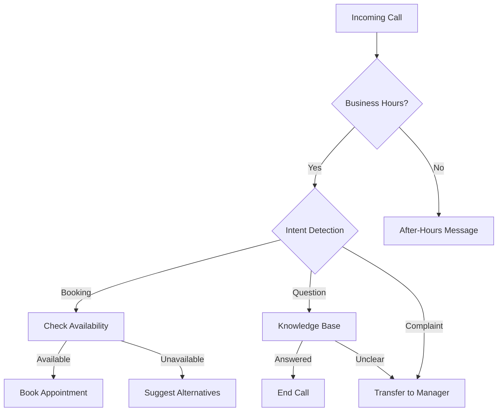

# Call Handling & Routing

Implement intelligent call handling with Skaala's AI receptionist.

## Overview

Skaala provides flexible call routing to ensure customers reach the right destination:

- **Smart Routing**: Route based on intent, time, or customer data
- **Overflow Handling**: Fallback options when agents unavailable
- **Business Hours**: Different routing for office hours vs after-hours
- **VIP Treatment**: Priority routing for high-value customers

## Call Flow Architecture



## Basic Call Routing

### Business Hours Configuration

```json
{
  "business_hours": {
    "monday": { "start": "09:00", "end": "17:00" },
    "tuesday": { "start": "09:00", "end": "17:00" },
    "wednesday": { "start": "09:00", "end": "17:00" },
    "thursday": { "start": "09:00", "end": "17:00" },
    "friday": { "start": "09:00", "end": "17:00" },
    "saturday": { "start": "10:00", "end": "14:00" },
    "sunday": "closed"
  },
  "timezone": "Europe/Stockholm"
}
```

### After-Hours Handling

<Tabs>
  <Tab title="Voicemail">
    Record message and create ticket

    ```javascript
    {
      "after_hours_action": "voicemail",
      "voicemail_prompt": "We're currently closed. Please leave a message.",
      "notify_email": "support@example.com"
    }
    ```
  </Tab>

  <Tab title="Emergency Transfer">
    Route urgent calls to on-call staff

    ```javascript
    {
      "after_hours_action": "emergency_transfer",
      "emergency_number": "+46701234567",
      "emergency_prompt": "For emergencies, I'll connect you now."
    }
    ```
  </Tab>

  <Tab title="Automated Booking">
    Allow self-service booking 24/7

    ```javascript
    {
      "after_hours_action": "booking_only",
      "booking_prompt": "I can help you schedule an appointment."
    }
    ```
  </Tab>
</Tabs>

## Advanced Routing

### Intent-Based Routing

Route calls based on detected customer intent:

```javascript
const routingRules = {
  "sales_inquiry": {
    action: "transfer",
    number: "+46701111111",
    message: "Let me connect you with sales"
  },
  "technical_support": {
    action: "transfer",
    number: "+46702222222",
    priority: "high"
  },
  "booking": {
    action: "ai_handle",
    tools: ["calendar", "booking"]
  },
  "general_question": {
    action: "ai_handle",
    tools: ["knowledge_base"]
  }
};
```

### Customer-Based Routing

<AccordionGroup>
  <Accordion title="VIP Customers">
    Detect VIP customers by phone number and provide priority service

    ```javascript
    if (customer.tier === 'vip') {
      return {
        greeting: "Welcome back, valued customer",
        wait_time: 0,
        transfer_priority: "immediate"
      };
    }
    ```
  </Accordion>

  <Accordion title="Returning Customers">
    Recognize returning customers and personalize greeting

    ```javascript
    if (customer.previous_calls > 0) {
      return {
        greeting: `Welcome back! I see you called about ${lastTopic}`,
        context: customer.history
      };
    }
    ```
  </Accordion>
</AccordionGroup>

## Call Analytics

Track and optimize call performance:

<CardGroup cols={2}>
  <Card title="Call Volume" icon="chart-line">
    Monitor peak hours and staffing needs
  </Card>

  <Card title="Resolution Rate" icon="check-circle">
    Track % of calls handled by AI vs transferred
  </Card>

  <Card title="Wait Times" icon="clock">
    Measure average hold and response times
  </Card>

  <Card title="Customer Satisfaction" icon="star">
    Post-call surveys and feedback
  </Card>
</CardGroup>

## Webhook Integration

React to call events in real-time:

```javascript
app.post('/webhooks/skaala', async (req, res) => {
  const { event, data } = req.body;

  switch (event) {
    case 'call.started':
      // Log call initiation
      await logCall(data.call_id, data.from);
      break;

    case 'call.transferred':
      // Notify agent of incoming transfer
      await notifyAgent(data.agent_id, data.call_context);
      break;

    case 'call.completed':
      // Update CRM with call summary
      await updateCRM(data.contact_id, data.summary);
      break;
  }

  res.status(200).send('OK');
});
```

## Best Practices

<Warning>
Test your routing rules thoroughly before deploying to production
</Warning>

<Steps>
  <Step title="Map Customer Journeys">
    Document all possible call paths and outcomes
  </Step>

  <Step title="Set Fallback Rules">
    Always have a default route for unexpected scenarios
  </Step>

  <Step title="Monitor & Optimize">
    Review call analytics weekly and adjust routing
  </Step>

  <Step title="Train Staff">
    Ensure human agents understand AI handoff process
  </Step>
</Steps>

## Related Resources

<CardGroup cols={2}>
  <Card title="Calls API" icon="phone" href="/api-reference/calls/list-calls">
    Programmatic call management
  </Card>

  <Card title="Webhooks" icon="webhook" href="/guides/webhooks">
    Real-time call event notifications
  </Card>
</CardGroup>
